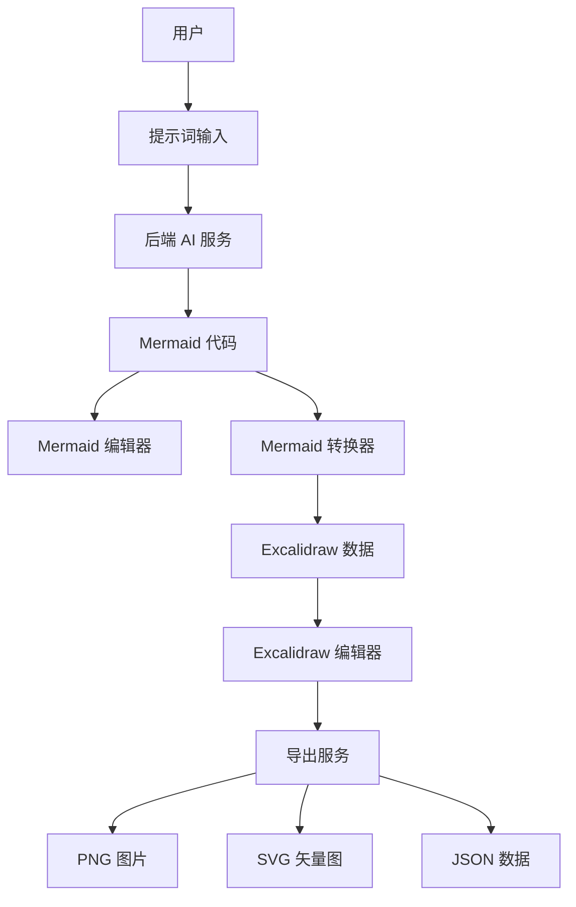
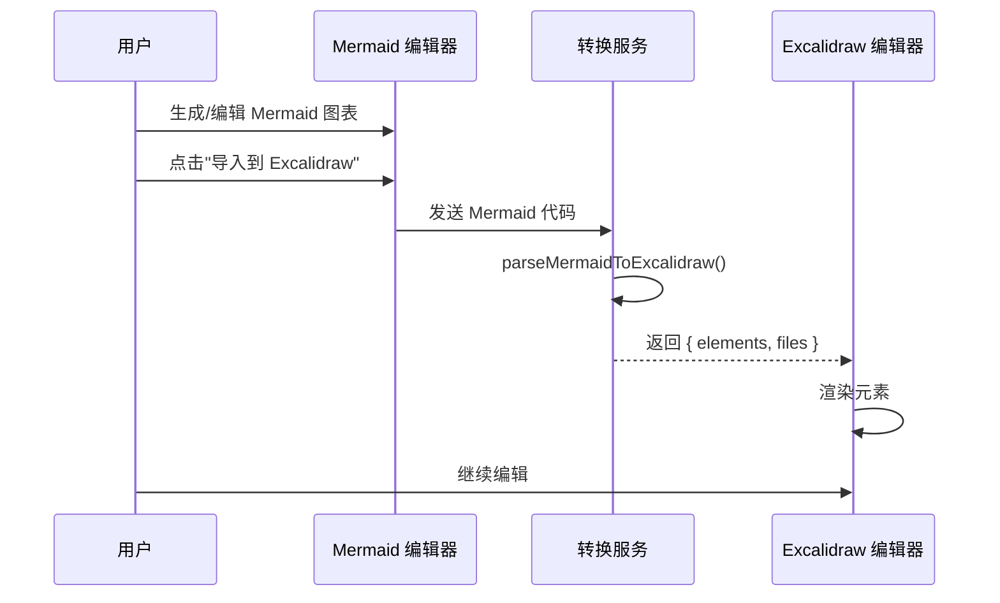

# Excalidraw 集成功能设计文档

## 1. 需求概述

### 1.1 核心目标
在现有 AI 图形生成应用中完整实现 Excalidraw 的所有功能，打造专业级的在线手绘白板编辑器，实现以下核心能力：

1. **完整的在线编辑和创建功能**：实现 Excalidraw 官方项目的所有编辑能力
2. **Mermaid 图表转换**：支持 AI 生成的 Mermaid 图表一键转换为 Excalidraw 格式
3. **本地存储与历史管理**：完整的本地自动保存和历史版本管理
4. **多格式导出**：支持 PNG、SVG、JSON、剪贴板等多种导出方式
5. **协作基础设施**：为未来的实时协作预留接口

### 1.2 用户场景

**场景 1：从空白画布开始创作**
- 用户切换到 Excalidraw 模式
- 使用完整的绘图工具创建流程图、架构图、线框图等
- 支持手绘、矩形、圆形、箭头、文本、图片等所有元素类型
- 实时自动保存到本地存储

**场景 2：AI 生成图表的美化与编辑**
- 用户通过 AI 生成 Mermaid 流程图/架构图
- 一键转换为 Excalidraw 手绘风格
- 在 Excalidraw 中自由编辑、美化、添加注释
- 导出为高质量图片或矢量图

**场景 3：专业图表创作**
- 使用形状库快速插入常用元素
- 精确对齐和分布元素
- 使用图层管理复杂图表
- 锁定元素防止误操作
- 分组管理相关元素

**场景 4：多设备工作流**
- 在桌面端创建图表
- 通过本地存储在同一浏览器中恢复工作
- 导出 JSON 文件跨设备传输
- 导入历史作品继续编辑

### 1.3 参考项目
- **Excalidraw 官方仓库**：https://github.com/excalidraw/excalidraw
  - 提供完整的手绘白板编辑器组件
  - 支持多种形状、箭头、文本、图片等元素
  - 内置导出功能（PNG/SVG/JSON）
  
- **mermaid-to-excalidraw 转换库**：https://github.com/excalidraw/mermaid-to-excalidraw
  - 提供 Mermaid 到 Excalidraw 的转换能力
  - 输出 Excalidraw 兼容的元素数组和文件对象

## 2. 系统架构设计

### 2.1 整体架构



### 2.2 组件关系

| 组件名称 | 职责 | 依赖 |
|---------|------|------|
| ExcalidrawWrapper | Excalidraw 编辑器包装器 | @excalidraw/excalidraw |
| MermaidConverter | Mermaid 到 Excalidraw 转换服务 | @excalidraw/mermaid-to-excalidraw |
| ExcalidrawToolbar | Excalidraw 工具栏增强组件 | ExcalidrawWrapper |
| ExportService | 导出服务（前端） | ExcalidrawWrapper, file-saver |

## 3. 功能设计

### 3.1 Excalidraw 完整功能实现

#### 3.1.1 完整的绘图工具集

实现 Excalidraw 官方的所有绘图工具，确保用户拥有完整的创作能力：

**核心绘图工具**：
| 工具名称 | 功能说明 | 快捷键 | 实现要点 |
|---------|---------|--------|----------|
| 选择工具 | 选中、移动、调整元素 | V 或 1 | 支持多选、框选、Shift 连续选择 |
| 矩形 | 绘制矩形/正方形 | R 或 2 | 按住 Shift 绘制正方形 |
| 菱形 | 绘制菱形 | D 或 3 | 决策节点专用形状 |
| 圆形 | 绘制椭圆/圆形 | O 或 4 | 按住 Shift 绘制正圆 |
| 箭头 | 绘制带箭头的连线 | A 或 5 | 支持单向、双向、直线、曲线 |
| 线条 | 绘制直线/折线 | L 或 6 | 支持多段折线 |
| 自由绘制 | 手绘路径 | P 或 7 | 压感笔支持（如可用） |
| 文本 | 添加文本标注 | T 或 8 | 支持多行、富文本样式 |
| 图片 | 插入图片 | 9 | 支持拖拽、粘贴、URL |
| 橡皮擦 | 擦除元素 | E 或 0 | 点击删除或框选批量删除 |

**形状库功能**：
| 功能 | 说明 | 实现方式 |
|------|------|----------|
| 内置形状库 | Excalidraw 官方形状库 | 集成 @excalidraw/excalidraw 内置库 |
| 流程图元素 | 开始/结束、处理、判断、数据等 | 预设模板 |
| UI 组件库 | 按钮、输入框、卡片等 | 自定义形状库 |
| 图标库 | 常用图标集合 | 集成第三方图标库 |
| 自定义库 | 用户保存常用元素 | 本地存储用户库 |

#### 3.1.2 元素属性与样式

**基础属性设置**：
| 属性类别 | 可配置项 | 说明 |
|---------|---------|------|
| 填充 | 纯色、哈希纹理、十字纹理、点状 | 支持透明度调节 |
| 边框 | 颜色、粗细、样式（实线/虚线） | 1-4 档粗细 |
| 不透明度 | 0-100% | 支持渐变透明 |
| 边角 | 圆角半径 | 0-50% 可调 |
| 手绘感 | Architect / Artist / Cartoonist | 调节手绘风格强度 |
| 边缘 | 锐利 / 圆滑 | 线条平滑度 |

**文本属性**：
| 属性 | 选项 | 说明 |
|------|------|------|
| 字体 | Hand-drawn, Normal, Code | 内置字体系列 |
| 字号 | 16 / 20 / 28 / 36 | 4 档预设大小 |
| 对齐 | 左 / 中 / 右 | 文本对齐方式 |
| 垂直对齐 | 顶部 / 居中 / 底部 | 容器内文本对齐 |
| 颜色 | 调色板 | 文本颜色 |

**箭头连线属性**：
| 属性 | 选项 | 说明 |
|------|------|------|
| 起点样式 | 无、箭头、圆点、方块 | 连线起点装饰 |
| 终点样式 | 无、箭头、圆点、方块 | 连线终点装饰 |
| 连线类型 | 直线、肘形、曲线 | 自动路由 |
| 绑定 | 绑定到形状 | 自动跟随元素移动 |
| 标签 | 文本标注 | 线条上的说明文字 |

#### 3.1.3 高级编辑功能

**元素操作**：
| 功能 | 快捷键 | 说明 |
|------|--------|------|
| 复制 | Ctrl+C | 复制选中元素 |
| 粘贴 | Ctrl+V | 粘贴元素 |
| 剪切 | Ctrl+X | 剪切元素 |
| 删除 | Delete / Backspace | 删除选中元素 |
| 全选 | Ctrl+A | 选中所有元素 |
| 撤销 | Ctrl+Z | 撤销上一步操作 |
| 重做 | Ctrl+Shift+Z | 重做操作 |
| 分组 | Ctrl+G | 组合多个元素 |
| 解组 | Ctrl+Shift+G | 拆分组合 |
| 锁定 | Ctrl+L | 锁定元素防止编辑 |
| 复制样式 | Ctrl+Alt+C | 复制元素样式 |
| 粘贴样式 | Ctrl+Alt+V | 应用样式到其他元素 |

**对齐与分布**：
| 功能 | 说明 | 使用场景 |
|------|------|----------|
| 左对齐 | 多个元素左边缘对齐 | 整理垂直列表 |
| 右对齐 | 多个元素右边缘对齐 | 整理垂直列表 |
| 顶部对齐 | 多个元素顶边对齐 | 整理水平列表 |
| 底部对齐 | 多个元素底边对齐 | 整理水平列表 |
| 水平居中 | 相对于画布或选区居中 | 标题居中 |
| 垂直居中 | 相对于画布或选区居中 | 内容居中 |
| 水平分布 | 均匀分布水平间距 | 规整流程图 |
| 垂直分布 | 均匀分布垂直间距 | 规整流程图 |

**图层管理**：
| 功能 | 快捷键 | 说明 |
|------|--------|------|
| 置于顶层 | Ctrl+Shift+] | 移到最上层 |
| 上移一层 | Ctrl+] | 向上移动一层 |
| 下移一层 | Ctrl+[ | 向下移动一层 |
| 置于底层 | Ctrl+Shift+[ | 移到最下层 |

#### 3.1.4 画布控制功能

**视图操作**：
| 功能 | 快捷键 | 说明 |
|------|--------|------|
| 平移画布 | Space + 拖动 | 手型工具移动视图 |
| 放大 | Ctrl + 滚轮上 | 缩放到鼠标位置 |
| 缩小 | Ctrl + 滚轮下 | 缩小视图 |
| 重置缩放 | Ctrl+0 | 回到 100% 缩放 |
| 适应选区 | Ctrl+2 | 缩放以适应选中内容 |
| 适应画布 | Ctrl+1 | 缩放以适应所有内容 |
| 全屏模式 | F | 进入/退出全屏 |
| 禅模式 | Alt+Z | 隐藏 UI 专注创作 |

**网格与对齐**：
| 功能 | 说明 | 配置 |
|------|------|------|
| 网格显示 | 显示背景网格 | 开关控制 |
| 吸附网格 | 元素自动吸附到网格 | 开关控制 |
| 吸附对象 | 元素自动对齐其他元素 | 智能参考线 |
| 网格大小 | 自定义网格间距 | 10/20/30px 可选 |

**背景设置**：
| 选项 | 说明 |
|------|------|
| 纯色背景 | 自定义背景颜色 |
| 透明背景 | 导出时支持透明 |
| 网格背景 | 显示网格线 |

#### 3.1.5 编辑器配置参数

**UIOptions 完整配置**：
```
界面配置对象定义

canvasActions:
  - changeViewBackgroundColor: 是否显示背景颜色切换（默认 true）
  - clearCanvas: 是否显示清空画布按钮（默认 true）
  - export: 是否显示导出按钮（默认 true）
  - loadScene: 是否显示加载场景按钮（默认 true）
  - saveToActiveFile: 是否显示保存按钮（默认 true）
  - theme: 是否显示主题切换（默认 true）
  - saveAsImage: 是否显示保存为图片（默认 true）

toolbar:
  - customItems: 自定义工具栏按钮数组

tools:
  - image: 是否启用图片工具（默认 true）
  - line: 是否启用线条工具（默认 true）
  - rectangle: 是否启用矩形工具（默认 true）
  - diamond: 是否启用菱形工具（默认 true）
  - ellipse: 是否启用圆形工具（默认 true）
  - arrow: 是否启用箭头工具（默认 true）
  - text: 是否启用文本工具（默认 true）
  - freedraw: 是否启用自由绘制（默认 true）
  - eraser: 是否启用橡皮擦（默认 true）
```

**语言与本地化**：
| 配置项 | 值 | 说明 |
|--------|----|----- |
| langCode | 'zh-CN' | 界面语言为中文 |
| 工具提示 | 自动翻译 | 所有提示文字显示中文 |
| 菜单项 | 自动翻译 | 右键菜单、下拉菜单中文化 |

### 3.2 本地存储与自动保存

#### 3.2.1 自动保存机制

**保存策略**：
| 策略类型 | 触发条件 | 保存内容 |
|---------|---------|----------|
| 实时保存 | 每次编辑操作后 | elements, appState, files |
| 防抖动保存 | 2 秒无操作后 | 减少存储频率 |
| 页面关闭前 | beforeunload 事件 | 确保数据不丢失 |
| 手动保存 | 用户点击保存按钮 | 创建历史快照 |

**存储键名设计**：
```
localStorage 键名结构

excalidraw_autosave: 当前工作状态（自动保存）
excalidraw_library: 用户自定义形状库
excalidraw_preferences: 用户偏好设置（网格、主题等）
diagram_history: 历史记录列表（复用现有）
```

**数据结构**：
```
自动保存数据结构

{
  elements: ExcalidrawElement[],  // 所有画布元素
  appState: {
    viewBackgroundColor: string,  // 背景颜色
    currentItemStrokeColor: string,  // 当前边框颜色
    currentItemBackgroundColor: string,  // 当前填充颜色
    currentItemFillStyle: string,  // 填充样式
    currentItemStrokeWidth: number,  // 边框宽度
    currentItemRoughness: number,  // 手绘感
    currentItemOpacity: number,  // 透明度
    currentItemFontFamily: number,  // 字体
    currentItemFontSize: number,  // 字号
    currentItemTextAlign: string,  // 文本对齐
    scrollX: number,  // 滚动位置 X
    scrollY: number,  // 滚动位置 Y
    zoom: { value: number },  // 缩放级别
    gridSize: number,  // 网格大小
    theme: 'light' | 'dark'  // 主题
  },
  files: BinaryFiles,  // 图片资源
  libraryItems: LibraryItem[],  // 当前使用的库项
  timestamp: number,  // 保存时间戳
  version: string  // 数据版本号
}
```

#### 3.2.2 历史版本管理

**版本快照策略**：
| 触发机制 | 保留时间 | 数量限制 |
|---------|---------|----------|
| 用户手动保存 | 永久保留 | 最近 20 条 |
| 每小时自动快照 | 24 小时 | 最近 10 条 |
| 关键操作快照 | 7 天 | 最近 50 条 |

**关键操作定义**：
- 从 Mermaid 转换而来
- 元素数量变化 > 10%
- 执行清空画布操作
- 导入外部文件

#### 3.2.3 数据导入导出

**导入功能**：
| 格式 | 支持方式 | 说明 |
|------|--------|------|
| .excalidraw | 完整支持 | Excalidraw 官方格式 |
| .json | 完整支持 | JSON 格式的场景数据 |
| .png | 提取元数据 | 带有嵌入数据的 PNG |
| 剪贴板 | 支持 | 直接粘贴元素 |
| 拖拽 | 支持 | 拖动文件到画布 |

**导出功能完整实现**：
| 格式 | 配置选项 | 输出特性 |
|------|--------|----------|
| PNG | 分辨率 (1x/2x/3x)、背景透明、暗色模式 | 高质量位图 |
| SVG | 嵌入字体、元数据 | 矢量图形 |
| JSON | 完整场景数据 | 可再编辑 |
| 剪贴板 | 图片/SVG/JSON | 快速分享 |
| .excalidraw | 官方格式 | 跨平台通用 |

**导出参数详细配置**：
```
PNG 导出选项
- scale: 1 | 2 | 3  (分辨率倍数)
- withBackground: boolean  (是否包含背景)
- exportPadding: number  (导出边距, 默认 10px)
- quality: 0.92  (JPEG 质量, 0-1)

SVG 导出选项
- exportEmbedScene: boolean  (嵌入场景数据)
- exportWithDarkMode: boolean  (使用暗色主题)
- embedFonts: boolean  (嵌入字体文件)

JSON 导出选项
- pretty: boolean  (格式化输出)
- includeLibraryItems: boolean  (包含库项)
```

### 3.3 图片与多媒体支持

#### 3.3.1 图片插入功能

**插入方式**：
| 方式 | 支持格式 | 说明 |
|------|--------|------|
| 本地文件 | PNG, JPG, GIF, SVG, WEBP | 通过文件选择器 |
| 拖拽上传 | 同上 | 拖动到画布任意位置 |
| 粘贴 | 剪贴板图片 | Ctrl+V 直接粘贴 |
| URL | 网络图片地址 | 输入 URL 加载 |
| 截图 | 系统截图 | 截图后粘贴 |

**图片处理**：
| 功能 | 说明 |
|------|------|
| 自动压缩 | 大于 2MB 的图片自动压缩 |
| 宽高锁定 | 保持图片比例 |
| 裁剪功能 | 双击进入裁剪模式 |
| 滤镜效果 | 灰度、模糊、亮度调节 |
| 遮罩形状 | 圆形、矩形、自定义路径 |

#### 3.3.2 嵌入元素支持

**支持的嵌入类型**：
- YouTube 视频：嵌入视频链接
- 网页框架：嵌入 iframe 内容
- 代码片段：语法高亮显示
- 数学公式：LaTeX 渲染支持

### 3.4 Mermaid 到 Excalidraw 转换

#### 3.2.1 转换流程设计



#### 3.2.2 转换服务实现

**转换服务接口**：
```
服务名称: MermaidConverterService
位置: frontend/src/services/mermaidConverter.ts

方法: convertMermaidToExcalidraw(mermaidCode: string, options?: ConversionOptions)

输入参数:
- mermaidCode: Mermaid 图表定义代码
- options: 可选配置参数
  - fontSize: 字体大小（默认 "20px"）
  - curve: 连线风格（"linear" | "basis"，默认 "linear"）

返回值:
- elements: ExcalidrawElement[] - Excalidraw 元素数组
- files: BinaryFiles - 二进制文件对象（用于图片等资源）

异常处理:
- 抛出 ConversionError 包含详细错误信息
- 用户友好提示：语法错误、不支持的图表类型等
```

#### 3.2.3 转换配置

**支持的 Mermaid 图表类型**（基于 mermaid-to-excalidraw 库能力）：
| 图表类型 | 支持状态 | 说明 |
|---------|---------|------|
| flowchart/graph | ✅ 完全支持 | 流程图 |
| sequenceDiagram | ✅ 完全支持 | 时序图 |
| classDiagram | ✅ 完全支持 | 类图 |
| stateDiagram | ✅ 完全支持 | 状态图 |
| erDiagram | ✅ 完全支持 | 实体关系图 |
| journey | ⚠️ 部分支持 | 旅程图 |
| gantt | ❌ 不支持 | 甘特图（复杂度高） |
| pie | ❌ 不支持 | 饼图（非结构化） |

**转换参数配置**：
| 配置项 | 类型 | 默认值 | 说明 |
|-------|------|--------|------|
| themeVariables.fontSize | string | "20px" | 文字大小 |
| flowchart.curve | "linear" \| "basis" | "linear" | 连线样式 |
| maxEdges | number | 500 | 最大边数限制 |
| maxTextSize | number | 50000 | 最大字符数 |

### 3.5 用户界面设计

#### 3.5.1 工具栏布局

**Excalidraw 原生工具栏**（保留全部功能）：
| 区域 | 内容 | 位置 |
|------|------|------|
| 左侧工具栏 | 选择、形状、箭头、文本、图片、橡皮擦、手绘 | 垂直排列 |
| 顶部操作栏 | 撤销、重做、清空、导出、库、主题 | 水平排列 |
| 属性面板 | 颜色、边框、填充、字体、对齐 | 右侧侧边栏 |
| 图层面板 | 元素列表、顺序调整 | 可收起面板 |

**自定义增强按钮**（添加到顶部工具栏）：
| 按钮名称 | 图标 | 功能 | 位置 |
|---------|------|------|------|
| 保存到历史 | Save | 创建历史快照 | 左侧组 |
| 从 Mermaid 导入 | FileImport | 转换 Mermaid 图表 | 左侧组 |
| 快速导出 | Download | 导出 PNG/SVG | 右侧组 |
| 切换模式 | Layout | 切换到 Mermaid | 右侧组 |

#### 3.5.2 侧边栏集成

**Sidebar 组件增强**：

当前 Sidebar 支持 Mermaid/Excalidraw 模式切换，需要增强以下内容：

**Excalidraw 模式下的侧边栏功能**：
| 功能模块 | 内容 | 说明 |
|---------|------|------|
| 快速操作 | 新建、打开、保存 | 文件管理 |
| 模板库 | Excalidraw 预设模板 | 流程图、线框图、思维导图等 |
| 形状库 | 常用元素集合 | 可搜索、可分类 |
| 历史记录 | 最近 20 条 Excalidraw 图表 | 缩略图预览 |
| 设置选项 | 网格、对齐、自动保存 | 用户偏好 |

**历史记录卡片设计**：
```
历史记录卡片结构

[缩略图] | 标题
         | 来源: AI生成 / 手动创建 / Mermaid转换
         | 时间: 2025-01-20 14:30
         | 元素: 15 个
         | [加载] [删除]
```

#### 3.5.3 模式切换增强

**三种工作模式**：
| 模式 | 说明 | 切换方式 |
|------|------|----------|
| Mermaid 模式 | AI 生成 + 代码编辑 | Sidebar 切换 |
| Excalidraw 模式 | 完整的手绘白板 | Sidebar 切换 |
| 混合模式 | Mermaid 转 Excalidraw | 点击转换按钮 |

**Mermaid 到 Excalidraw 转换流程**：
1. 用户在 Mermaid 模式下生成或编辑图表
2. 点击 MermaidEditor 工具栏的“导入到 Excalidraw”按钮
3. 系统显示“正在转换...”加载动画
4. 转换完成，自动切换到 Excalidraw 模式
5. 保留原始 Mermaid 代码供回溯

**界面提示设计**：
| 状态 | 提示内容 | 交互 |
|------|----------|------|
| 转换中 | “正在将 Mermaid 图表转换为 Excalidraw...” | 加载动画 |
| 转换成功 | 无弹窗，自动切换视图 | 页面切换 |
| 转换失败 | “转换失败：[错误原因]” | Toast 提示 |
| 不支持类型 | “该图表类型暂不支持转换” | Toast 提示 |

#### 3.5.4 响应式布局适配

**多分辨率适配**：
| 分辨率 | 布局调整 | 说明 |
|---------|---------|------|
| 1920x1080 | 标准三栏布局 | Sidebar(300px) + 编辑区(400px) + 画布 |
| 2560x1440 | 扩大画布区域 | 保持工具栏宽度 |
| 4K (3840x2160) | 居中对齐 | 工作区居中，左右留白 |
| < 1366x768 | 侧边栏默认收起 | 最大化画布空间 |

**垂直滚动禁止**：
- 所有内容在一个视口内完整显示
- 禁止页面级别垂直滚动条
- Excalidraw 画布内部滚动由其自身控制

### 3.6 协作功能基础设施

#### 3.6.1 实时协作架构预留

虽然当前阶段不实现实时协作，但需要为未来预留接口：

**技术方案**：
| 组件 | 技术选型 | 说明 |
|------|--------|------|
| 通信协议 | WebSocket | 已在后端项目中 |
| 数据同步 | OT / CRDT | 冲突解决算法 |
| 光标显示 | Excalidraw 内置 | 显示协作者光标 |
| 权限控制 | 后端 API | 只读/编辑权限 |

**预留接口设计**：
```
协作接口定义

接口名称: CollaborationService
方法:
  - initCollaboration(roomId: string): Promise<void>
  - joinRoom(roomId: string, userId: string): Promise<void>
  - leaveRoom(): void
  - broadcastChanges(elements: ExcalidrawElement[]): void
  - onRemoteChange(callback: (elements) => void): void
  - getCursors(): Map<userId, CursorPosition>

事件:
  - user-joined: 用户加入
  - user-left: 用户离开
  - elements-changed: 元素变化
  - cursor-moved: 光标移动
```

#### 3.6.2 分享与权限

**分享功能设计**：
| 功能 | 实现方式 | 说明 |
|------|--------|------|
| 生成分享链接 | 后端 API | 生成唯一 URL |
| 只读模式 | 禁用编辑工具 | 仅可查看和导出 |
| 权限级别 | 所有者/编辑者/观看者 | 后端权限控制 |
| 链接过期 | 自定义过期时间 | 1天/7天/永久 |

**分享链接格式**：
```
https://yourdomain.com/excalidraw/share/{shareId}
查询参数:
  - mode=view 或 edit
  - token={accessToken}
```

#### 3.6.3 评论与反馈

**评论功能预留**：
- 在画布上添加评论标记
- 评论线程管理
- @提及用户通知
- 已解决/未解决状态

### 3.7 高级特性

#### 3.7.1 快捷键系统

**全局快捷键**：
| 快捷键 | 功能 | 分类 |
|--------|------|------|
| Ctrl+S | 保存到历史 | 文件操作 |
| Ctrl+E | 导出菜单 | 文件操作 |
| Ctrl+K | 打开库 | 工具 |
| Ctrl+/ | 快捷键帮助 | 帮助 |
| Esc | 取消当前操作 | 通用 |
| F1 | 打开帮助文档 | 帮助 |

**自定义快捷键**：
用户可以在设置中自定义快捷键，存储在 localStorage。

#### 3.7.2 搜索与命令面板

**命令面板功能**（类似 VS Code）：
- 快捷键：Ctrl+Shift+P
- 模糊搜索所有命令
- 快速执行常用操作

**可搜索命令**：
- 切换主题
- 打开形状库
- 导出图表
- 调整网格大小
- 对齐元素
- 分组操作

#### 3.7.3 插件系统预留

**插件架构**：
```
插件接口定义

interface ExcalidrawPlugin {
  id: string;
  name: string;
  version: string;
  
  onLoad(): void;
  onUnload(): void;
  
  registerTool?(tool: CustomTool): void;
  registerExporter?(exporter: CustomExporter): void;
  registerImporter?(importer: CustomImporter): void;
}
```

**可扩展点**：
- 自定义绘图工具
- 自定义导出格式
- 第三方库集成
- AI 辅助功能

## 4. 数据模型设计

### 4.1 Excalidraw 元素数据结构

**DiagramState 扩展**（已存在，需增加字段）：
```
接口名称: DiagramState
位置: frontend/src/types.ts

现有字段:
- mermaidCode: string - Mermaid 代码
- excalidrawElements: ExcalidrawElement[] - Excalidraw 元素数组
- title: string - 图表标题

新增字段:
- excalidrawFiles?: BinaryFiles - 二进制文件（图片等）
- excalidrawAppState?: AppState - Excalidraw 应用状态（视口、缩放等）
- sourceType?: 'ai' | 'manual' | 'converted' - 来源类型
- conversionMetadata?: { originalMermaidCode: string, convertedAt: number } - 转换元数据
```

### 4.2 历史记录扩展

**HistoryItem 扩展**（已存在，需增强）：
```
接口名称: HistoryItem
位置: frontend/src/types.ts

现有字段:
- id: string
- timestamp: number
- type: DiagramType
- preview: string
- state: DiagramState

增强说明:
- 当 type 为 EXCALIDRAW 且 sourceType 为 'converted' 时，保留原始 Mermaid 代码
- preview 字段生成缩略图预览（使用 Excalidraw 导出功能）
```

### 4.3 转换错误类型

**错误类型定义**：
| 错误代码 | 错误名称 | 说明 | 用户提示 |
|---------|---------|------|---------|
| SYNTAX_ERROR | 语法错误 | Mermaid 代码无效 | "Mermaid 语法错误，请检查代码" |
| UNSUPPORTED_DIAGRAM | 不支持的图表 | 图表类型不支持转换 | "该图表类型暂不支持转换到 Excalidraw" |
| CONVERSION_FAILED | 转换失败 | 转换过程异常 | "转换失败，请重试或联系支持" |
| EMPTY_DIAGRAM | 空图表 | 图表内容为空 | "图表内容为空，无法转换" |

## 5. 技术实现方案

### 5.1 依赖包管理

**新增 NPM 依赖**：
| 包名称 | 版本 | 用途 |
|--------|------|------|
| @excalidraw/mermaid-to-excalidraw | latest | Mermaid 转换库 |

**已有依赖（无需新增）**：
- @excalidraw/excalidraw: ^0.18.0 ✅
- mermaid: ^11.12.1 ✅
- file-saver: ^2.0.5 ✅

### 5.2 文件结构规划

**新增文件**：
```
frontend/src/
├── services/
│   ├── mermaidConverter.ts          # Mermaid 转换服务
│   └── excalidrawExport.ts          # Excalidraw 导出服务
├── components/
│   └── ExcalidrawToolbar.vue        # Excalidraw 工具栏组件（可选）
└── composables/
    └── useExcalidrawConversion.ts   # 转换逻辑 Composable
```

**修改文件**：
```
frontend/src/
├── components/
│   ├── ExcalidrawWrapper.vue        # 增强功能：工具栏、语言配置
│   ├── MermaidEditor.vue            # 添加"导入到 Excalidraw"按钮
│   └── Sidebar.vue                  # 模式切换提示优化
├── types.ts                          # 扩展类型定义
└── App.vue                           # 转换逻辑集成
```

### 5.3 关键实现逻辑

#### 5.3.1 转换服务核心逻辑

**服务职责**：
- 接收 Mermaid 代码字符串
- 调用 parseMermaidToExcalidraw API
- 处理转换异常
- 返回标准化数据结构

**核心流程**：
1. 验证 Mermaid 代码非空
2. 调用 mermaid-to-excalidraw 的 parseMermaidToExcalidraw 方法
3. 捕获异常并分类处理（语法错误、不支持类型等）
4. 返回 { elements, files, appState } 给调用方
5. 记录转换元数据用于历史溯源

**配置传递**：
- 默认使用项目统一的字体大小配置
- 支持用户自定义连线风格（linear/basis）
- 继承当前主题设置（dark/light）

#### 5.3.2 ExcalidrawWrapper 组件增强

**增强内容**：
1. **语言配置**：设置 langCode="zh-CN"，使界面显示中文
2. **初始状态管理**：接收 initialData 包含 elements 和 files
3. **事件监听增强**：监听 onChange 事件，实时同步状态到父组件
4. **工具栏配置**：通过 UIOptions 自定义工具栏显示项
5. **主题同步**：监听 isDarkMode 变化，同步更新 Excalidraw 主题

**Props 扩展**：
| 属性名 | 类型 | 必填 | 说明 |
|--------|------|------|------|
| elements | ExcalidrawElement[] | 是 | 元素数组 |
| files | BinaryFiles | 否 | 二进制文件 |
| initialAppState | AppState | 否 | 初始应用状态 |
| isDarkMode | boolean | 否 | 主题模式 |

**Emits 扩展**：
| 事件名 | 参数 | 说明 |
|--------|------|------|
| update:elements | ExcalidrawElement[] | 元素更新 |
| update:files | BinaryFiles | 文件更新 |
| update:appState | AppState | 应用状态更新 |

#### 5.3.3 MermaidEditor 增强

**新增按钮**：
- 按钮文本："导入到 Excalidraw"
- 图标：使用 lucide-vue-next 的 ArrowRight 或 Send 图标
- 位置：工具栏导出按钮旁边
- 样式：与现有工具栏按钮保持一致

**点击处理**：
1. 触发 convert-to-excalidraw 事件
2. 传递当前 Mermaid 代码
3. 父组件（App.vue）接收事件并执行转换

#### 5.3.4 App.vue 转换逻辑集成

**新增方法**：
```
方法名称: handleConvertToExcalidraw
触发时机: 用户点击"导入到 Excalidraw"按钮
参数: mermaidCode: string

执行流程:
1. 设置 isLoading 为 true，显示转换动画
2. 调用 MermaidConverterService.convertMermaidToExcalidraw(mermaidCode)
3. 获取转换结果 { elements, files }
4. 更新 diagramState:
   - excalidrawElements = elements
   - excalidrawFiles = files
   - sourceType = 'converted'
   - conversionMetadata = { originalMermaidCode, convertedAt: Date.now() }
5. 切换 activeTab 为 DiagramType.EXCALIDRAW
6. 保存到历史记录（包含转换元数据）
7. 设置 isLoading 为 false

异常处理:
- 捕获 ConversionError，显示用户友好错误提示
- 保持在 Mermaid 模式，不切换视图
- 记录错误日志到控制台
```

### 5.4 状态管理策略

**组件间通信**：
- App.vue 作为状态管理中心
- 使用 Vue 3 Reactive 系统管理 diagramState
- 通过 Props 向下传递数据
- 通过 Emits 向上传递事件

**本地存储策略**：
- Excalidraw 状态自动保存到 localStorage
- 键名：diagram_history（复用现有历史记录机制）
- 存储内容：包含 elements、files、appState
- 存储时机：用户手动保存或自动定时保存（每 30 秒）

**历史记录策略**：
- 转换操作作为独立历史记录项
- 保留原始 Mermaid 代码用于回溯
- 最多保存 20 条历史记录（与现有逻辑一致）

## 6. 用户交互流程

### 6.1 标准转换流程

**步骤说明**：
1. 用户在侧边栏选择"Mermaid"模式
2. 输入提示词，AI 生成 Mermaid 图表
3. 用户在代码编辑器中调整 Mermaid 代码（可选）
4. 点击 Mermaid 工具栏的"导入到 Excalidraw"按钮
5. 系统显示"正在转换图表..."加载提示
6. 转换完成，自动切换到 Excalidraw 模式
7. 用户在 Excalidraw 中自由编辑（移动节点、添加注释、修改样式等）
8. 点击"保存"按钮，图表保存到历史记录
9. 点击"导出"按钮，选择 PNG/SVG/JSON 格式导出

### 6.2 错误处理流程

**场景 1：Mermaid 语法错误**
- 转换前验证 Mermaid 代码有效性
- 提示："Mermaid 语法错误，请检查代码后重试"
- 保持在 Mermaid 模式，高亮错误行（如可能）

**场景 2：不支持的图表类型**
- 检测图表类型（如 Gantt、Pie）
- 提示："该图表类型暂不支持转换到 Excalidraw，支持的类型有：流程图、时序图、类图等"
- 提供支持类型列表链接

**场景 3：转换服务异常**
- 捕获网络错误或库异常
- 提示："转换失败，请稍后重试"
- 提供重试按钮

### 6.3 回退与撤销机制

**返回 Mermaid 模式**：
- Excalidraw 工具栏提供"返回 Mermaid"按钮
- 点击后切换回 Mermaid 模式，加载原始 Mermaid 代码
- 如果原始代码丢失，提示用户从历史记录中恢复

**撤销/重做**：
- 利用 Excalidraw 原生的撤销/重做功能（Ctrl+Z / Ctrl+Y）
- 无需额外实现

## 7. 性能优化策略

### 7.1 转换性能

**优化点**：
- 大型图表（节点数 > 50）显示转换进度提示
- 限制最大节点数（建议 100 个节点以内）
- 超大图表提示用户简化或分割

**性能指标**：
| 图表规模 | 节点数 | 预期转换时间 |
|---------|--------|-------------|
| 小型 | 1-20 | < 500ms |
| 中型 | 21-50 | 500ms - 2s |
| 大型 | 51-100 | 2s - 5s |
| 超大 | > 100 | 不建议转换 |

### 7.2 渲染性能

**Excalidraw 渲染优化**：
- 初始化时禁用不必要的动画
- 使用虚拟化渲染（Excalidraw 内置）
- 大画布情况下启用懒加载

**内存管理**：
- 清理未使用的历史记录
- 限制 localStorage 存储大小（单条记录 < 2MB）
- 大型图表导出后提示用户删除历史记录

## 8. 测试策略

### 8.1 功能测试点

**转换功能测试**：
| 测试场景 | 输入 | 预期输出 |
|---------|------|---------|
| 简单流程图 | 3节点流程图 Mermaid 代码 | 成功转换，3个元素 |
| 复杂时序图 | 5角色时序图 | 成功转换，保留顺序 |
| 语法错误 | 错误的 Mermaid 代码 | 显示错误提示 |
| 不支持类型 | Gantt 图代码 | 提示不支持 |
| 空代码 | 空字符串 | 提示图表为空 |

**编辑功能测试**：
| 测试场景 | 操作 | 预期结果 |
|---------|------|---------|
| 移动元素 | 拖动节点 | 节点位置更新 |
| 添加注释 | 绘制文本框 | 文本正确显示 |
| 修改颜色 | 更改元素颜色 | 颜色实时更新 |
| 导出 PNG | 点击导出按钮 | 生成高清 PNG 图片 |

### 8.2 兼容性测试

**浏览器兼容性**：
| 浏览器 | 版本要求 | 测试重点 |
|--------|---------|---------|
| Chrome | >= 90 | 完整功能测试 |
| Edge | >= 90 | 完整功能测试 |
| Firefox | >= 88 | Canvas 渲染测试 |
| Safari | >= 14 | 导出功能测试 |

**设备适配**：
- 桌面端：1920x1080、2560x1440、4K 分辨率
- 确保 Excalidraw 画布在不同分辨率下正常显示

### 8.3 性能测试

**测试指标**：
- 小型图表（10 节点）转换时间 < 1 秒
- 中型图表（50 节点）转换时间 < 3 秒
- Excalidraw 渲染 100 个元素时 FPS > 30
- 导出 PNG 时间 < 2 秒

## 9. 部署与集成

### 9.1 开发环境配置

**依赖安装**：
在 frontend 目录执行：
```
npm install @excalidraw/mermaid-to-excalidraw
```

**开发调试**：
- 使用 Vite 热更新功能
- Chrome DevTools 用于调试转换逻辑
- Vue DevTools 用于查看组件状态

### 9.2 生产环境部署

**构建配置**：
- Vite 构建命令保持不变（npm run build）
- Excalidraw 库已支持 Tree Shaking，打包体积优化
- 确保 mermaid-to-excalidraw 正确打包到 vendor chunk

**Docker 配置**：
- 无需修改 frontend/Dockerfile（依赖已包含在 package.json）
- 构建时自动安装所有依赖

**Nginx 配置**：
- 无需额外配置，现有配置支持所有前端路由

### 9.3 回滚策略

**功能隔离**：
- 转换功能仅影响前端，后端无变动
- 出现问题可快速禁用转换按钮
- 历史记录兼容新旧格式

**版本管理**：
- Git 分支策略：feature/excalidraw-integration
- 合并前完整测试所有功能
- 保留回滚点（merge 前的 commit）

## 10. 后续优化方向

### 10.1 短期优化（1-2 周）
1. **转换样式配置**：支持用户自定义转换后的字体大小、颜色主题
2. **批量转换**：支持从历史记录批量转换多个 Mermaid 图表
3. **快捷键支持**：为转换操作添加快捷键（如 Ctrl+Shift+E）

### 10.2 中期优化（1-2 月）
1. **双向同步**：Excalidraw 修改后可反向生成 Mermaid 代码（技术难度高）
2. **模板库集成**：提供 Excalidraw 预设模板
3. **协作编辑**：基于 Excalidraw 内置协作功能实现多人实时编辑
4. **AI 辅助编辑**：在 Excalidraw 中调用 AI 优化布局

### 10.3 长期规划（3-6 月）
1. **移动端适配**：Excalidraw 移动端编辑体验优化
2. **插件系统**：支持第三方 Excalidraw 插件集成
3. **云存储**：Excalidraw 图表云端保存与分享
4. **版本管理**：Excalidraw 图表版本历史追踪

## 11. 风险评估

### 11.1 技术风险

| 风险项 | 风险等级 | 影响 | 缓解措施 |
|--------|---------|------|---------|
| mermaid-to-excalidraw 库兼容性 | 中 | 部分图表转换失败 | 提前测试常见图表类型，不支持的给出明确提示 |
| 大型图表性能问题 | 中 | 转换/渲染卡顿 | 设置节点数上限，优化渲染逻辑 |
| 浏览器兼容性 | 低 | 部分浏览器功能异常 | 针对主流浏览器测试，提供降级方案 |

### 11.2 用户体验风险

| 风险项 | 风险等级 | 影响 | 缓解措施 |
|--------|---------|------|---------|
| 转换结果不符预期 | 中 | 用户需手动大量调整 | 优化默认转换参数，提供预览功能 |
| 学习成本 | 低 | 用户不熟悉 Excalidraw 操作 | 提供引导教程、工具提示 |
| 历史记录混乱 | 低 | 用户难以区分 Mermaid/Excalidraw | 增加明确的视觉标识和标签 |

### 11.3 业务风险

| 风险项 | 风险等级 | 影响 | 缓解措施 |
|--------|---------|------|---------|
| 功能复杂度上升 | 低 | 维护成本增加 | 代码模块化，充分注释文档 |
| 用户习惯改变 | 低 | 部分用户不适应新功能 | 保留原有 Mermaid 纯编辑模式 |

## 12. 成功指标

### 12.1 功能完成度
- ✅ Excalidraw 编辑器完整集成
- ✅ Mermaid 到 Excalidraw 转换功能正常运行
- ✅ 支持至少 5 种 Mermaid 图表类型转换
- ✅ 导出功能（PNG/SVG/JSON）正常
- ✅ 中文界面配置完成

### 12.2 性能指标
- 中型图表（30 节点）转换时间 < 2 秒
- Excalidraw 渲染 FPS > 30
- 无明显内存泄漏

### 12.3 用户体验指标
- 转换成功率 > 95%
- 用户操作流程顺畅，无卡顿
- 错误提示清晰友好

---

**设计文档版本**：v1.0  
**创建日期**：2025-01-XX  
**最后更新**：2025-01-XX  
**设计负责人**：AI Architect
